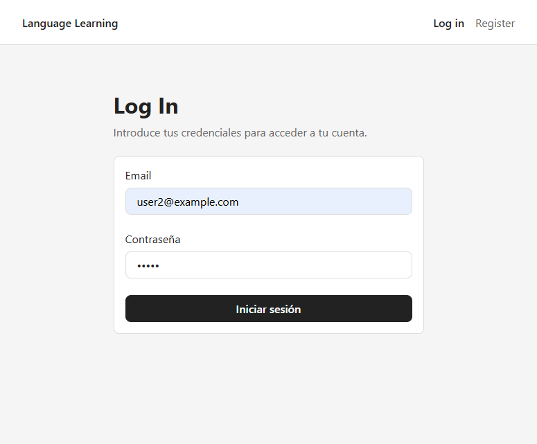
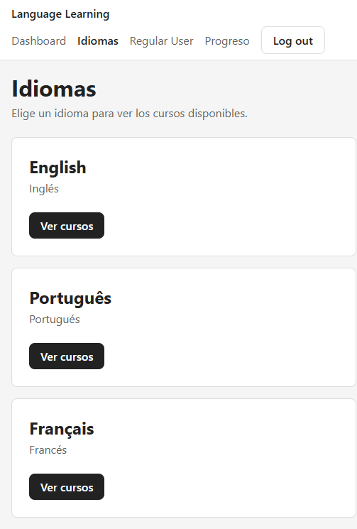
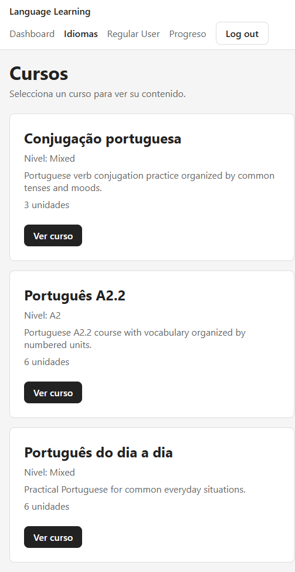
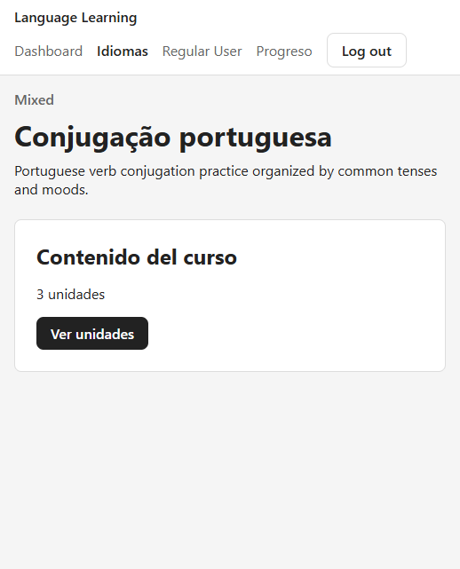
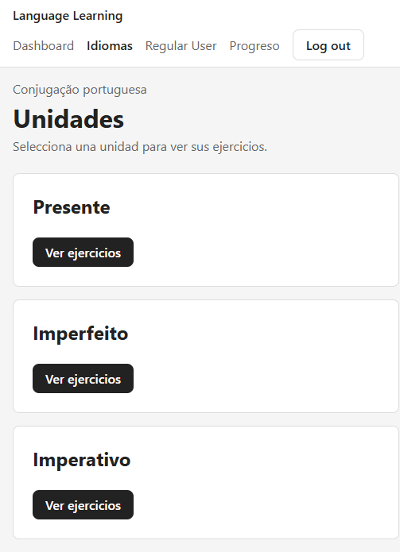
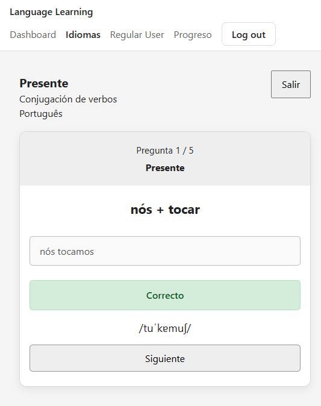
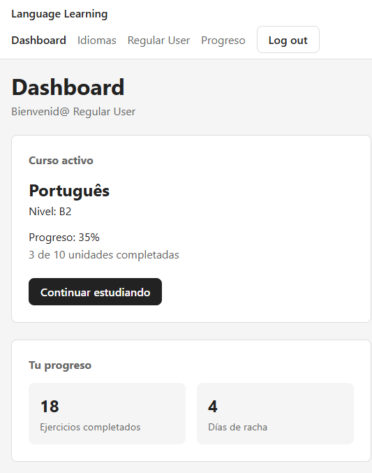

# 🧿 Language Learning — Full Stack MVP

Aplicación Full Stack desarrollada como proyecto final de **ThePower**.

El proyecto es un **MVP de una plataforma de estudio de idiomas orientada al usuario estudiante**. Permite registrarse e iniciar sesión, seleccionar un idioma y un curso, navegar por sus unidades y realizar actividades de estudio con contenido almacenado en MongoDB.

Actualmente incluye una actividad funcional de **conjugación de verbos portugueses**. La arquitectura está preparada para seguir incorporando contenido, ejercicios, progreso y un futuro dashboard de administración.

> Documentación: 
> - [README](./README.md)
> - [Notas de desarrollo](./docs/notas_desarrollo.md)
> - [Justificación de requisitos](./docs/justificacion-requisitos.md)

---

## Demo y repositorios

| | Frontend | Backend |
|---|---|---|
| **Vercel** | [Aplicación](https://fullstack-project-frontend-nine.vercel.app/) | [Vercel API / Healthcheck](https://fullstack-project-backend-woad.vercel.app/) |
| **GitHub** | [fullstack-project-frontend](https://github.com/candytale55/fullstack-project-frontend) | [fullstack-project-backend](https://github.com/candytale55/fullstack-project-backend) |

El frontend y el backend están desplegados de forma independiente en **Vercel** y se comunican mediante una API REST. También funciona en local.

---

## Flujo principal del MVP

```text
Register / Login
       ↓
   Languages
       ↓
    Courses
       ↓
     Units
       ↓
   Exercise
```

El ejercicio de conjugación permite seleccionar el número de preguntas, responder, recibir feedback inmediato y repetir o finalizar la sesión.

---

## Screenshots

### Autenticación

| Register | Login |
|---|---|
|  |  |

### Idiomas y cursos

| Idiomas | Cursos |
|---|---|
|  |  |

### Curso y unidades

| Curso | Unidades |
|---|---|
|  |  |

### Ejercicio de conjugación

| Inicio | Respuesta | Final |
|---|---|---|
|  |  |  |

### Dashboard actual



---

## Tecnologías principales

**Frontend:** React, TypeScript, Vite, React Router y CSS Modules.  
**Backend:** Node.js, Express, TypeScript, MongoDB y Mongoose.

Más detalles técnicos: [notas_desarrollo.md](./docs/notas_desarrollo.md).

---

## Ejecución local

### 1. Backend

```bash
git clone https://github.com/candytale55/fullstack-project-backend.git
cd fullstack-project-backend
npm install
```

Crear `.env` a partir de `.env.example`:

```env
PORT=3000
MONGO_URI=
JWT_SECRET=
FRONTEND_URL=http://localhost:5173
```

Cargar los datos iniciales **en este orden**:

```bash
npm run seed:all
npm run seed:ptverbs
```

Iniciar el servidor:

```bash
npm run dev
```

Backend local:

```text
http://localhost:3000
```

### 2. Frontend

```bash
git clone https://github.com/candytale55/fullstack-project-frontend.git
cd fullstack-project-frontend
npm install
```

Crear `.env` a partir de `.env.example`:

```env
VITE_API_URL=http://localhost:3000
```

Iniciar:

```bash
npm run dev
```

Frontend local:

```text
http://localhost:5173
```

Las variables privadas no se almacenan en los repositorios. Los archivos `.env.example` sirven como referencia para la configuración. Incluí las variables que utilicé en el mensaje con la entrega del proyecto. 

---

## Estado

**MVP funcional**, enfocado en demostrar el flujo Full Stack principal del usuario estudiante (y pasar el curso).

Para detalles de arquitectura, seeds, autenticación, API, base de datos y decisiones de implementación, consultar [notas_desarrollo.md](./docs/notas_desarrollo.md).
